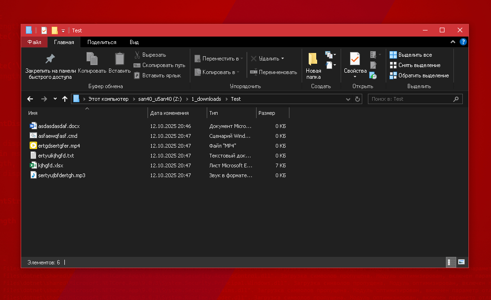
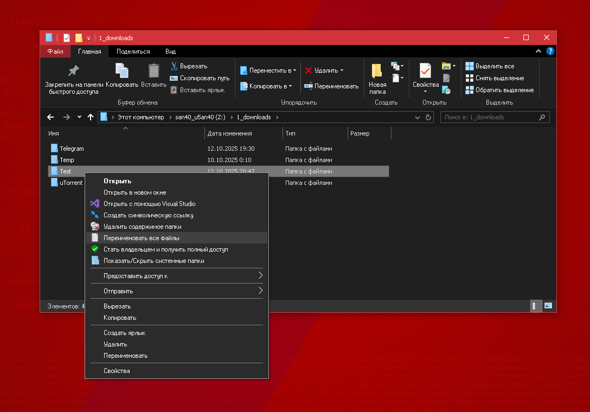
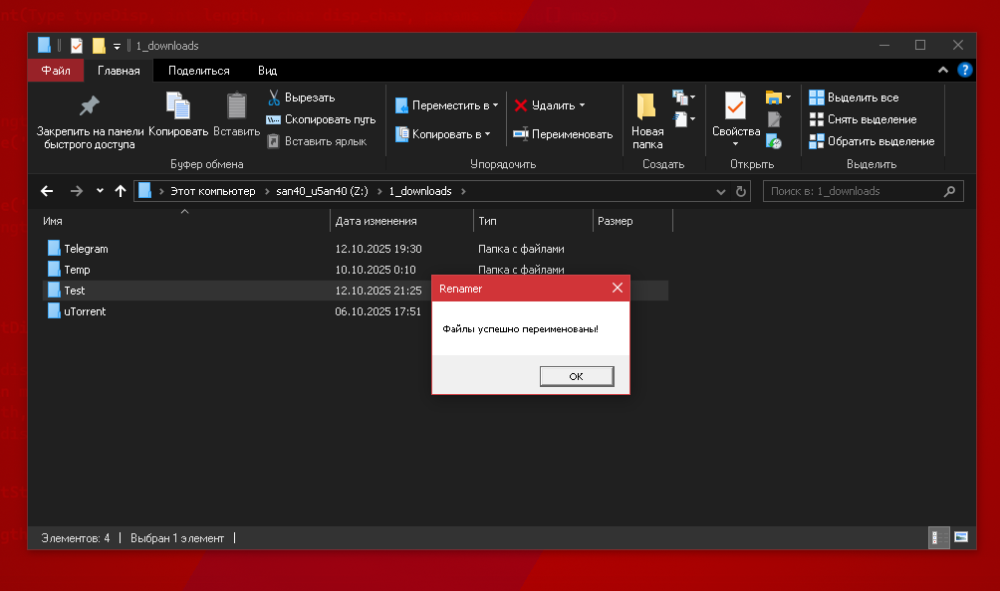
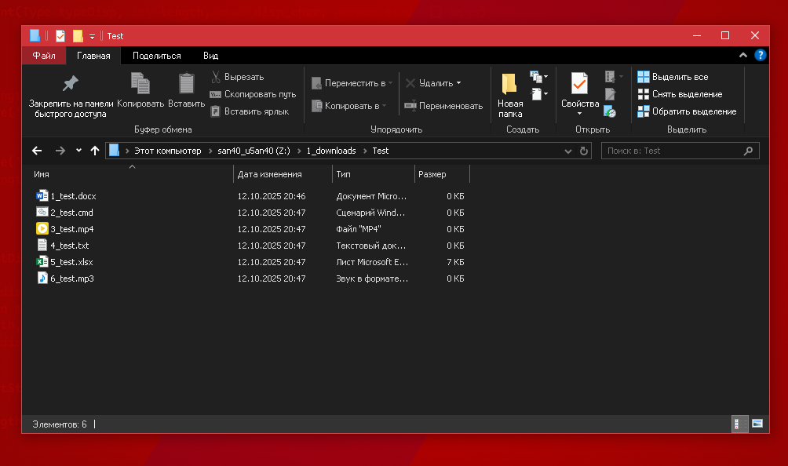
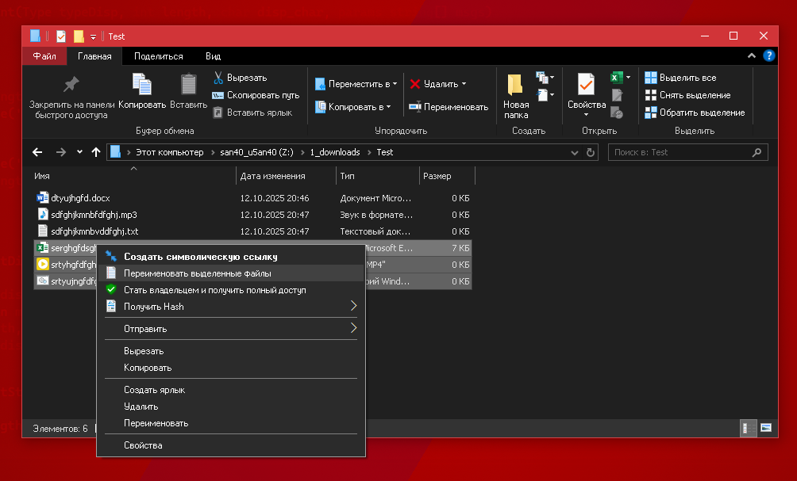
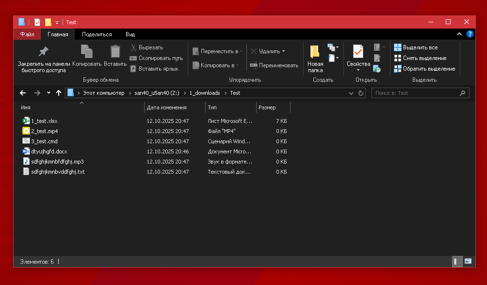

# Renamer
## Назначение:
Программа для массового переименования файлов в проводнике Windows.

## Примеры использования:
### Переименование всех файлов в папке
Содержимое папки:

Использование программы через контекстное меню:

При успешном переименовании появится соответствующее уведомление:

Результат:

### Выборочное переименование файлов
Также можно переименовать файлы выборочно:

Результат:

## Перспективы развития
Ведётся разработка графического установщика пунктов контекстного меню в реестре. В данный момент необходимо настраивать контекстное меню самостоятельно.
